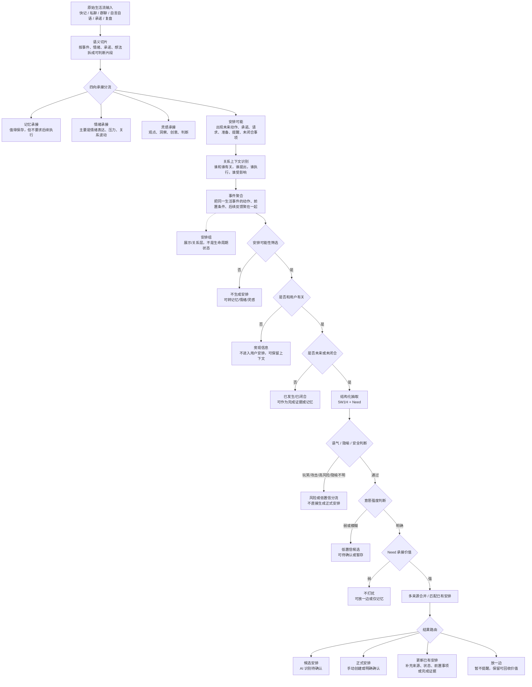

# 安排信息漏斗底层约束

本文档定义“安排”模块的信息识别漏斗。后续任何涉及安排识别、AI 识别、候选安排、正式安排、安排组、多来源合并、从快记/私聊/群聊/用户承诺中生成安排的需求，都必须先遵守本文档。

本文档不是页面设计稿，也不是开发排期。它约束的是：AI 面对大量生活流信息时，如何一步步判断“什么才是真正要做安排的内容”。

## 核心原则

- 原始生活流不能直接变成安排。必须先切片、分流、聚合、判断，再进入安排结果。
- “候选安排”和“正式安排”是安排实体的生命周期状态。
- “安排组”不是第三种生命周期状态，而是多个相关安排、前置事项、情绪上下文、来源证据的聚合展示层。
- 多个来源指向同一生活事件时，应合并为一个安排实体，并在详情中保留全部来源上下文。
- 5W1H 字段齐全不代表安排成立。还必须判断用户相关性、未来/未闭合状态、语气/隐喻/安全性、意愿强度和 Need 承接价值。
- AI 自动识别出的内容默认先进入候选安排。只有用户手动创建、明确确认，或系统有足够强的确认信号时，才进入正式安排。
- 漏斗的目标不是“尽可能多地产生任务”，而是“尽可能少误判、少打扰，并承接真正值得用户后续处理的生活事项”。

## 总流程图



## 逐步转化细则

### 1. 原始生活流输入

输入可能是一大段碎碎念、快记、私聊、群聊、对自己的承诺、对他人的回复、事后复盘，也可能混杂情绪、事实、想法和行动。此时不能急着抽取任务。

这一层只确认“有一段生活信息进入系统”，不判断它是不是安排。

### 2. 语义切片

把连续文本拆成可判断的片段。切片单位不是自然句，而是语义单元：一个动作、一个未闭合事项、一个情绪表达、一个观点、一段关系背景、一个完成证据。

例如“明天上数学课，课件还没准备，电动车还没充，好烦啊”至少可切为：

- 明天上数学课
- 课件还没准备
- 电动车还没充
- 好烦啊

这些片段后续会被分流和重新聚合，而不是直接变成四个任务。

### 3. 四向承接分流

每个切片先进入四类承接通道之一：

- 记忆承接：值得保存，但不要求后续执行。
- 情绪承接：主要表达压力、期待、愤怒、想念、焦虑等。
- 灵感承接：观点、洞察、判断、创意、方法论。
- 安排可能：包含未来动作、承诺、请求、准备、提醒、未闭合事项。

只有“安排可能”继续进入安排漏斗。其他通道可以作为安排上下文，但不能直接变成安排。

### 4. 关系上下文识别

判断这件事涉及谁：

- 谁提出了事项。
- 谁承诺了事项。
- 谁需要执行。
- 谁会受影响。
- 信息来自快记、私聊、群聊还是自我输入。

这一步决定安排是否属于当前用户，也决定后续详情里如何解释来源和责任。

### 5. 事件聚合

把同一生活事件的多个片段聚合起来。一个事件可能包含主安排、前置准备、相关人物、时间地点、情绪背景、后续反馈。

例如“上数学课”是主事件；“课件没准备”“电动车没充”是前置事项；“好烦啊”是情绪上下文。它们应形成一个相关事件簇，而不是互相割裂的任务列表。

安排组在这一层附近出现：它是事件簇的展示/关系层，用来把相关安排和上下文放在一起，但不是候选安排、正式安排之外的第三种状态。

### 6. 安排可能性筛选

判断这个事件簇是否真的有“后续需要落地”的特征。典型信号包括：

- 未来要做的动作。
- 已经答应他人的请求。
- 需要准备或补救的事项。
- 需要在某个时间前处理。
- 当前尚未完成或尚未闭合。

如果只是描述事实、回忆、情绪或观点，不进入安排。

### 7. 用户相关性判断

判断事项是否应该进入当前用户的安排系统。

私聊中“你明天来公司帮我带早餐”，如果用户回复“好的”，通常与用户相关。群聊中的他人安排，如果用户只是旁观，默认不进入用户安排，除非用户被点名、承诺、负责或明显受影响。

### 8. 未来性与未闭合判断

安排关注“尚未完成、需要后续承接”的生活事项。

如果信息描述的是已经发生并闭合的事情，通常不生成新安排；但它可能作为已有安排的完成证据。例如“我今天上午去医院体检了，没啥问题”不应生成新的“去医院”安排，而应尝试更新之前的医院相关安排。

### 9. 5W1H + Need 结构化

结构化字段用于帮助解释安排，而不是决定安排是否成立。

- Who：相关人、提出人、执行人、受影响人。
- What：要做什么。
- When：时间点、时间段、截止、模糊时间。
- Where：地点或场景。
- Why：原因、关系背景、用户动机。
- How：执行方式、前置条件、AI 可协助部分。
- Need：用户真正需要被承接的东西，例如“别忘了”“提前准备”“降低焦虑”“兑现承诺”“等待确认”。

其中 Need 是核心。没有 Need 的字段抽取只是信息整理，不一定值得生成安排。

### 10. 语气、隐喻与安全判断

同样包含时间和动作的句子，可能并不是安排。

- “我特别想你，想要明天买票去哈尔滨见你”可能是高情绪价值的候选安排，但不应直接变成正式行程。
- “我明天要到杭州揍扁你”包含时间、地点、动作，但更可能是玩笑、情绪或风险表达，不应生成正式安排。
- “～～”这类用户自定义隐喻，AI 大概率无法可靠识别，应保留手动创建和低置信确认入口。

这一层负责防止 AI 把玩笑、攻击、隐喻、危险表达、夸张表达误判为安排。

### 11. 意愿强度判断

判断用户是否真的表达了执行意愿或承诺。

强信号包括“好的”“我会”“已经约了”“明天去”“记得提醒我”。弱信号包括“可能”“有空再说”“想想看”“也许”。弱信号可以进入低置信候选或放一边，不应打扰式提醒。

### 12. Need 承接价值判断

即使它是未来事项，也要判断是否值得系统承接。

高价值 Need 通常包括：容易遗忘、影响他人、需要准备、时间敏感、关系承诺、身体/安全/工作重要事项。低价值或非常随意的内容可以只记忆、放一边，或等待用户主动确认。

### 13. 多来源合并与匹配已有安排

在生成新安排前，必须先尝试匹配已有安排，避免重复制造事项。

例如用户先说“后天去医院”，父亲提醒“一定记得去医院”，姐姐询问“身体怎么办”，用户回复“已经挂号了”。这些都应合并到同一个医院相关安排里，并在详情中保留来源：

- 原始自我规划。
- 父亲提醒。
- 姐姐关心。
- 用户已经挂号的进展。

多来源合并的结果是“一个安排实体，多个来源证据”，不是多条重复安排。

### 14. 结果路由

漏斗末端只能进入以下结果之一：

- 不处理：没有承接价值或明显不是安排。
- 记忆：值得保存，但不需要执行。
- 情绪：主要承接情绪状态。
- 灵感：主要承接观点或想法。
- 候选安排：AI 识别出的高价值可能安排，需要用户确认或自然浮现。
- 正式安排：用户手动创建、明确确认，或有强确认信号。
- 更新已有安排：补充来源、前置事项、状态、完成证据或关系上下文。
- 放一边：暂时不提醒、不压迫，但保留后续回收价值。
- 风险/安全分流：攻击、危险、隐喻不明、高风险表达，不直接生成安排。

## 数据建模约束

实现时应把生命周期、状态、关注度和聚合关系分开建模。

```ts
type ArrangementLifecycle = "candidate" | "formal";

type ArrangementStatus = "pending" | "done" | "archived";

type ArrangementAttentionLevel = "today" | "recent" | "later" | "quiet";

type ArrangementGroup = {
  primaryArrangementId: string;
  relatedArrangementIds: string[];
  prerequisiteItemIds: string[];
  emotionalContextRefs: string[];
  sourceRefs: string[];
};
```

约束：

- 不要把 `group` 建模成 lifecycle 或 status。
- 不要把“安排组”放在首页一层结构中与候选安排、正式安排并列。
- 不要因为有多个来源就创建多个安排实体。
- 不要因为有 5W1H 就直接创建正式安排。
- 不要因为事项过期就用强红色、强失败感逼迫用户处理；过期未完成可以进入“以后再说/放一边/温和整理”。

## 典型样例

### 碎碎念输入

输入：

```text
明天上数学课，课件还没准备，电动车还没充，好烦啊
```

漏斗结果：

- 主安排：明天上数学课。
- 前置事项：准备课件、给电动车充电。
- 情绪上下文：好烦。
- 展示关系：可形成一个安排组。
- 生命周期：AI 自动识别时默认是候选安排，不是正式安排。

### 高情绪价值输入

输入：

```text
我特别想你，想要明天买票去哈尔滨见你。
```

漏斗结果：

- 识别为高情绪、高意愿、可能有未来动作。
- 可进入候选安排或情绪+候选安排混合承接。
- 不应直接生成正式安排，除非用户确认买票或手动创建。

### 风险或玩笑输入

输入：

```text
我明天要到杭州揍扁你。
```

漏斗结果：

- 虽然有时间、地点、动作，但语气/安全判断不通过。
- 不生成正式安排。
- 可进入情绪或风险分流，必要时弱化承接。

### 灵感输入

输入：

```text
通话是暴露情绪。
```

漏斗结果：

- 这是观点或洞察。
- 进入灵感承接，不进入安排。

### 多来源医院事件

输入来源：

- 用户：“后天去趟医院。”
- 父亲：“一定记得去医院，知道吗？”
- 用户：“好的，我已经有安排了。”
- 姐姐：“你这个身体情况怎么办？”
- 用户：“我已经到医院挂号了。”

漏斗结果：

- 合并为一个医院相关安排。
- 详情中保留多个来源上下文。
- “已经挂号了”是进展证据，可能更新安排状态或补充执行信息。
- 不创建多条重复的“去医院”安排。

## 首页层级约束

首页一层结构应围绕用户可理解的承接状态，而不是围绕底层聚合对象。

推荐一层：

- AI 识别 / 待确认：候选安排自然浮现，让用户轻量确认。
- 正式安排：用户明确接受或手动创建的安排。
- 放一边：暂不提醒、不压迫，但保留后续回收价值。

不推荐一层：

- 把“安排组”作为与候选安排、正式安排并列的大板块。

安排组适合出现在详情页、关联上下文、同一事件簇、来源证据或整理视图中，用于解释“为什么这些内容属于同一件生活事项”。
